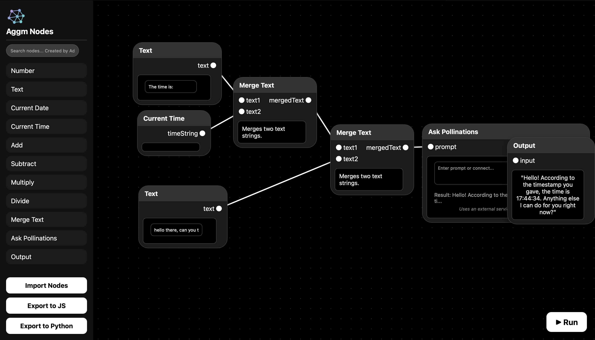

# Aggm Nodes

Aggm Nodes is a node based IDE app created by Adolfo GM. It allows users to visually create and manage workflows using a node-based interface.

## Features

- Connect nodes to form workflows
- Save and load workflows
- Export to Python code or JavaScript code

# License

MIT License

